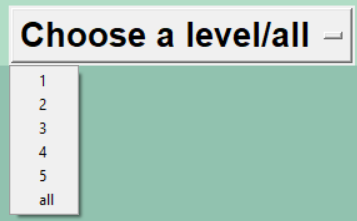

# Introducing Flashcards Vocabulary Trainer
**Flashcards Vocabulary Trainer** is a Python application, inspired by the [100 Days of Code](https://www.udemy.com/course/100-days-of-code/) online course, that helps you with learning the vocabulary of a foreign language by using the Flashcard approach: you are shown a foreign word and after a few seconds, you are shown the translation.

# Features
## Explain me the GUI
After clicking on 'main.py', the first Flashcard is displayed with a randomly chosen foreign word:
 
After a few seconds, the translation of the word is shown.

If you knew the translation, you can click on the right green OK button and the word is removed from your words to learn CSV file. If you click on the red X, the word is kept in the file and will be displayed for review again.

On the top of the GUI, there is a dropdown that let's you choose the difficulty level (1-5) of your words:

 

If you don't choose a level, words across all levels will be displayed for review.

In case you choose a level that does not exist in your file, you get the following warning:
 

## Where do I get my words to learn from?
You need to populate the words you would like to learn in a CSV file 'words_to_learn.csv' in the data folder. The file expects a simple content:

 

First column is the foreign word, second column the translation and third column is the level (1-5).

There is another file present in the data folder: 'words_to_learn_all.csv.' This file contains all the words you have been trying to learn since the start. Keep in mind, the words that you click on OK on the Flashcard are deleted from the other file 'words_to_learn.csv'. The _all file comes in handy in case you would like to review again the words you (or your kid in my case) believe you know it already 😉

When adding new words, you add them only into the file 'words_to_learn.csv.' The new added words are automatically synchronized into the 'words_to_learn_all.csv' when you start the app, so that they are saved for repeated review. 

# Installation and Setup
- Download the entire project code to your computer and unzip files locally.
- Install the following packages that are not part of the standard Python installation if you don't have them yet:
    - pip install pandas
- You populate the file 'words_to_learn.csv' with the words you would like to learn.
- You can setup the flip time in seconds in the following constant in the main.py file: FLIP_TIME_IN_SECONDS = 5.
- run 'main.py'.
